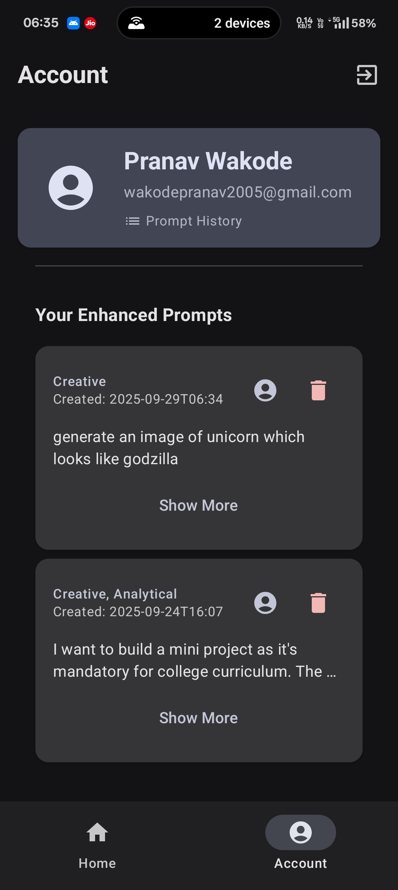

# PromptCraft - AI-Powered Prompt Enhancement

PromptCraft is a modern Android application that helps users create high-quality, effective prompts for generative AI models using Google Gemini API. The app features a clean, Material 3 design with dark mode by default and follows modern Android development best practices.

## Features

### 🎯 Core Features
- **AI-Powered Prompt Enhancement**: Uses Google Gemini API to enhance user prompts
- **Prompt Type Selection**: Support for various prompt engineering techniques (Zero-Shot, Few-Shot, Chain-of-Thought, Role-Playing, etc.)
- **History Management**: Local storage of enhanced prompts with Room database
- **User Authentication**: Google Sign-In and Guest mode support

### 🎨 UI/UX Features
- **Material 3 Design**: Modern, clean interface following Google's design guidelines
- **Dark Mode Default**: Dark theme by default with light mode toggle
- **Responsive Layout**: Optimized for different screen sizes
- **Bottom Navigation**: Easy access to Home and History screens
- **Copy & Edit**: Easy prompt copying and editing functionality

### 🏗️ Technical Features
- **MVVM Architecture**: Clean, maintainable code structure
- **Single Activity**: Modern navigation with Jetpack Compose
- **Dependency Injection**: Hilt for clean dependency management
- **Coroutines & Flows**: Asynchronous operations and reactive UI
- **Room Database**: Local data persistence for history

## Usage

### First Launch
1. Choose "Sign in with Google" or "Continue as Guest"
2. Access the main prompt enhancement screen

<p align="center">
  
  &nbsp;&nbsp;&nbsp;&nbsp;&nbsp;&nbsp;
</p>

### Enhancing Prompts
1. Enter your initial prompt in the text field
2. Select prompt types or use "Auto" for automatic selection
3. Tap "Enhance Prompt"
4. If the AI needs more information, answer the follow-up question
5. View, copy, or edit the enhanced prompt

<p align="center">
  
  &nbsp;&nbsp;&nbsp;&nbsp;&nbsp;&nbsp;
</p>

### Viewing History
1. Tap the "History" tab in bottom navigation
2. View all previously enhanced prompts
3. Tap any item to expand and see details
4. Copy original or enhanced prompts
5. Delete unwanted prompts

<p align="center">
  
</p>

### Settings
1. Tap the settings icon in the top bar
2. Toggle between dark and light modes
3. View app information

<p align="center">
  
</p>

## Tech Stack

- **Language**: Kotlin
- **UI**: Jetpack Compose + Material 3
- **Architecture**: MVVM with Repository pattern
- **Dependency Injection**: Hilt
- **Database**: Room
- **Navigation**: Jetpack Navigation Compose
- **Async**: Kotlin Coroutines + Flows
- **Authentication**: Firebase Authentication
- **AI Integration**: Google Gemini API
- **Version Control**: Git

## Project Structure

```
app/src/main/java/com/pranav/promptcraft/
├── data/
│   ├── database/          # Room database setup
│   └── repository/        # Repository implementations
├── domain/
│   ├── model/            # Domain models
│   └── repository/       # Repository interfaces
├── presentation/
│   ├── screens/          # Compose screens
│   ├── components/       # Reusable UI components
│   ├── viewmodels/       # ViewModels
│   └── navigation/       # Navigation setup
├── di/                   # Hilt dependency injection modules
└── ui/theme/            # Theme and styling
```

## Setup Instructions

### Prerequisites
- Android Studio Hedgehog or later
- Android SDK 26 (Android 8.0) or higher
- Google Gemini API key
- Firebase project (for authentication)

### 1. Clone and Setup Project
```bash
https://github.com/pranav-wakode/prompt-engineer.git
cd prompt-engineer
```

### 2. Set Up Your Google Gemini API Key
1. This project uses local.properties to handle secret keys securely.
2. Create a file named local.properties in the root directory of the project.
3. Add your Gemini API key to this file:
```bash
GEMINI_API_KEY=AIz......................................
```

### 3. Configure Firebase (Optional - for Google Sign-In)
1. Create a Firebase project at [Firebase Console](https://console.firebase.google.com/)
2. Add your Android app to the project
3. Download `google-services.json` and place it in the `app/` directory
4. Enable Authentication and configure Google Sign-In provider

### 4. Build and Run
1. Open the project in Android Studio
2. Sync the project (Gradle sync)
3. Build and run on device or emulator

## Architecture Details

### MVVM Pattern
- **Model**: Domain entities and data models
- **View**: Jetpack Compose UI components
- **ViewModel**: Business logic and state management

### Repository Pattern
- Clean separation between data sources and business logic
- Abstract interfaces in domain layer
- Concrete implementations in data layer

## Future Enhancements

- [ ] Implement proper Google Sign-In flow
- [ ] Add prompt templates
- [ ] Support for multiple AI models
- [ ] Export/import functionality
- [ ] Advanced prompt analytics
- [ ] Offline mode capabilities
- [ ] Prompt sharing features
